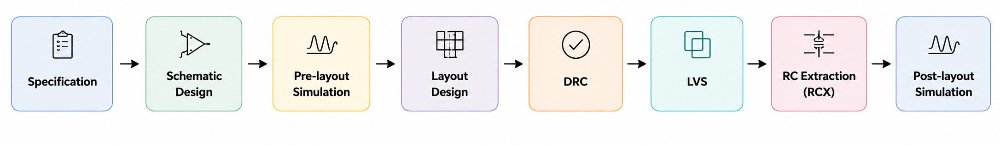

# Cadence Projects

A collection of IC design and layout projects built using **Cadence Virtuoso**. This repository serves as a central hub for individual circuit design projects, each organized as its own self-contained subfolder with schematics, layouts, simulation results, and documentation.

## Repository Structure

```
Cadence_Projects/
├── CMOS_Inverter/
│   ├── design/
│   ├── docs/
│   ├── reports/
│   ├── screenshots/
│   └── simulations/
├── (future project folders...)
└── README.md
```

Each project subfolder follows a consistent internal structure:

| Folder         | Contents                                                        |
|----------------|------------------------------------------------------------------|
| `design/`      | Cadence Virtuoso schematic and layout cellviews / library files |
| `docs/`        | Design notes, specifications, theory, and reference material     |
| `reports/`     | DRC, LVS, and post-layout simulation reports                     |
| `screenshots/` | Schematic/layout images for quick visual reference                |
| `simulations/` | Testbenches, simulation setups, and result plots/data             |

---

## Design Flow

<p align="center">
  
</p>

---

## Design Environment

- **EDA Tool:** Cadence Virtuoso Layout Suite XL
- **Circuit Simulator:** Spectre
- **Verification:** Assura (DRC, LVS, RCX)
- **Technology:** GPDK090 CMOS Technology


---

## Projects

| Project | Description | Status |
|---|---|---|
| [CMOS_Inverter](./CMOS_Inverter) | Basic CMOS inverter — schematic, layout, and DRC/LVS verification | In Progress |

----
## Purpose

This repository documents practical experience with the complete custom IC design flow using industry-standard Cadence tools. The projects are intended to strengthen understanding of:

- CMOS circuit design
- Analog and digital layout techniques
- Physical verification (DRC/LVS)
- Parasitic extraction
- Pre-layout and post-layout simulation
- Design documentation and reproducibility

---

## Author

**Lalith Kishore M**

Electronics and Communication Engineering (ECE)

Cadence Virtuoso • Analog IC Design • Digital IC Design • Physical Layout • CMOS VLSI
